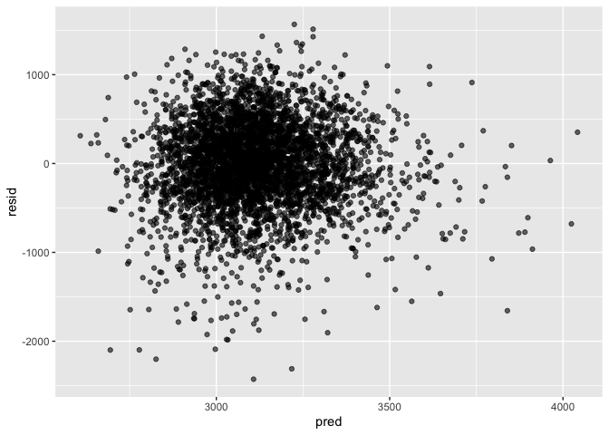
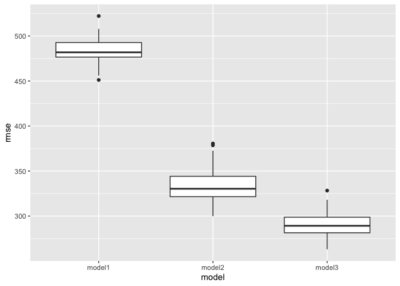
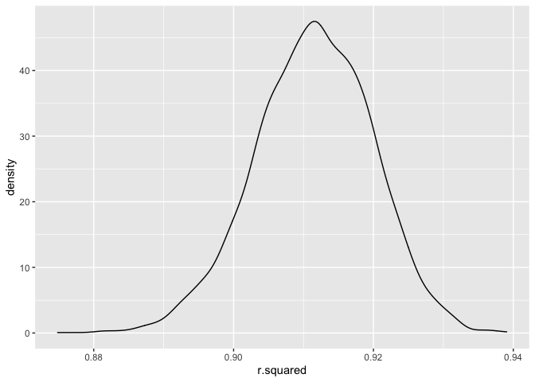
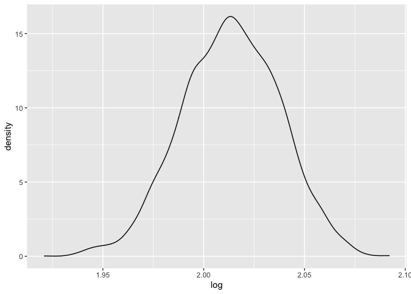

p8105\_hw6\_yw3608
================
Yuxuan Wang
12/2/2021

# Problem 1

**Prepare data,and check if missing data exist and drop na**

``` r
bw_df = 
  read_csv("./data/birthweight.csv") %>%
  drop_na()
```

**Clean data, mutate several variables to factors,change level’s name
and show the data**

``` r
bw_clean = 
  bw_df %>% 
  mutate(
    babysex = as.factor(babysex),
    father_race = as.factor(frace),
    mother_race = as.factor(mrace),
    malform = as.factor(malform)
  )  %>%
  mutate(
    babysex = recode(babysex, "1" = "male", "2" = "female"),
    father_race = recode(father_race, "1" = "white", "2" = "black", "3" = "asian", "4" = "puertorican", "8" = "other", "9" = "unknown"), 
    mother_race = recode(mother_race, "1" = "white", "2" = "black", "3" = "asian", "4" = "puertorican", "8" =   "other"),
    malform = recode(malform, "0" = "absense", "1" = "present")
    ) 
 
head(bw_clean,4) %>% 
knitr::kable(digits = 3)
```

| babysex | bhead | blength |  bwt | delwt | fincome | frace | gaweeks | malform | menarche | mheight | momage | mrace | parity | pnumlbw | pnumsga |  ppbmi | ppwt | smoken | wtgain | father\_race | mother\_race |
|:--------|------:|--------:|-----:|------:|--------:|------:|--------:|:--------|---------:|--------:|-------:|------:|-------:|--------:|--------:|-------:|-----:|-------:|-------:|:-------------|:-------------|
| female  |    34 |      51 | 3629 |   177 |      35 |     1 |    39.9 | absense |       13 |      63 |     36 |     1 |      3 |       0 |       0 | 26.272 |  148 |      0 |     29 | white        | white        |
| male    |    34 |      48 | 3062 |   156 |      65 |     2 |    25.9 | absense |       14 |      65 |     25 |     2 |      0 |       0 |       0 | 21.345 |  128 |      0 |     28 | black        | black        |
| female  |    36 |      50 | 3345 |   148 |      85 |     1 |    39.9 | absense |       12 |      64 |     29 |     1 |      0 |       0 |       0 | 23.565 |  137 |      1 |     11 | white        | white        |
| male    |    34 |      52 | 3062 |   157 |      55 |     1 |    40.0 | absense |       14 |      64 |     18 |     1 |      0 |       0 |       0 | 21.845 |  127 |     10 |     30 | white        | white        |

**Regression Model**

``` r
 model1 = lm(bwt ~ wtgain + delwt, data = bw_clean)
  summary(model1) %>% 
  broom::tidy() %>% 
  knitr::kable(digits = 20)
```

| term        |    estimate |  std.error | statistic | p.value |
|:------------|------------:|-----------:|----------:|--------:|
| (Intercept) | 2207.798411 | 49.2541216 | 44.824643 |       0 |
| wtgain      |    7.135086 |  0.7436604 |  9.594549 |       0 |
| delwt       |    5.145574 |  0.3664926 | 14.040048 |       0 |

``` r
  bw_clean %>% 
  modelr::add_predictions(model1) %>%
  modelr::add_residuals(model1) %>%
  ggplot(aes(x = resid, y = pred)) +
  geom_point(alpha = 0.6) 
```

<!-- -->

**Here, i construct a model and set baby’s birth weight as y, and let it
depend on the mother’s weight at delivery (pounds) and mother’s weight
gain during pregnancy (pounds). Next, show a plot of model residuals
against fitted values.** **Notice: Some the p values here are too small
to be shown on the table, thus all the p values shown in knitr::kable
are 0**

**Prepare the other two required models**

``` r
model2 = lm(bwt ~ blength + gaweeks, data = bw_clean)
model3 = lm(bwt ~ bhead + blength + babysex + bhead*blength + bhead*babysex + blength*babysex + bhead*blength*babysex, data = bw_clean)

summod2 =
summary(model2) %>% 
  broom::tidy() %>% 
knitr::kable(digits = 20)
summod2
```

| term        |    estimate | std.error | statistic | p.value |
|:------------|------------:|----------:|----------:|--------:|
| (Intercept) | -4347.66707 | 97.958360 | -44.38281 |       0 |
| blength     |   128.55569 |  1.989891 |  64.60439 |       0 |
| gaweeks     |    27.04673 |  1.717930 |  15.74379 |       0 |

``` r
summod3 =
summary(model3) %>% 
  broom::tidy() %>% 
knitr::kable(digits = 20)
summod3
```

| term                        |      estimate |    std.error |  statistic |      p.value |
|:----------------------------|--------------:|-------------:|-----------:|-------------:|
| (Intercept)                 | -7176.8170221 | 1264.8397394 | -5.6740920 | 1.485151e-08 |
| bhead                       |   181.7956350 |   38.0542051 |  4.7772811 | 1.835551e-06 |
| blength                     |   102.1269235 |   26.2118095 |  3.8962180 | 9.918043e-05 |
| babysexfemale               |  6374.8683508 | 1677.7669213 |  3.7996150 | 1.469088e-04 |
| bhead:blength               |    -0.5536096 |    0.7802092 | -0.7095656 | 4.780117e-01 |
| bhead:babysexfemale         |  -198.3931810 |   51.0916850 | -3.8830816 | 1.046771e-04 |
| blength:babysexfemale       |  -123.7728875 |   35.1185360 | -3.5244319 | 4.287772e-04 |
| bhead:blength:babysexfemale |     3.8780531 |    1.0566296 |  3.6702106 | 2.452669e-04 |

**Notice: the p values here are too small to be shown on the table, thus
all the p values shown in knitr::kable are 0**

**Compare the model to two other models, refers to the example of p8105
course page example**

``` r
  cvpe_df = 
  crossv_mc(bw_clean, 100) %>% 
   mutate(
    train = map(train, as_tibble),
    test = map(test, as_tibble)
  ) %>% 
  mutate(
    model1 = map(train, ~ lm(bwt~ wtgain + delwt, data =.x )),
    model2 = map(train, ~ lm(bwt ~ blength + gaweeks, data = .x)),
    model3 = map(train, ~ lm(bwt ~ bhead + blength + babysex + bhead*blength + bhead*babysex +       blength*babysex + bhead*blength*babysex, data = .x))) %>%
  mutate(
    rmse_model1 = map2_dbl(model1, test, ~rmse(model = .x, data = .y)),
    rmse_model2 = map2_dbl(model2, test, ~rmse(model = .x, data = .y)),
    rmse_model3 = map2_dbl(model3, test, ~rmse(model = .x, data = .y)))

cvpe_df %>% 
  select(starts_with('rmse')) %>% 
  pivot_longer(
    rmse_model1:rmse_model3,
    names_to = 'model',
    values_to = 'rmse', 
    names_prefix = 'rmse_'
  ) %>% 
  ggplot(aes(x = model, y = rmse)) +
  geom_boxplot()
```

<!-- -->

**According to the plot, the best model is model 3**

# Problem2

``` r
weather_df = 
  rnoaa::meteo_pull_monitors(
    c("USW00094728"),
    var = c("PRCP", "TMIN", "TMAX"), 
    date_min = "2017-01-01",
    date_max = "2017-12-31") %>%
  mutate(
    name = recode(id, USW00094728 = "CentralPark_NY"),
    tmin = tmin / 10,
    tmax = tmax / 10) %>%
  select(name, id, everything())
```

**Bootstrap and calculate r^2, ci and plot**

``` r
bootstrap_df_r2 = 
  weather_df %>%
  bootstrap(n = 5000, id = "bootstrap")%>%
 mutate(
    fit = map(.x = strap, ~lm(tmax ~ tmin, data = .x)),
    result = map(fit, broom::glance)
    ) %>%
  select(bootstrap,result)%>%
  unnest(result)


r_2_CI =
  bootstrap_df_r2 %>% 
  summarize(
  lower_bound = quantile(adj.r.squared, 0.025), 
  upper_bound = quantile(adj.r.squared, 0.975)) %>% 
  knitr::kable() 
r_2_CI   
```

| lower\_bound | upper\_bound |
|-------------:|-------------:|
|    0.8933368 |    0.9265168 |

``` r
r_2_plot =
  bootstrap_df_r2 %>% 
  ggplot(aes(x = r.squared)) +
  geom_density() 
r_2_plot
```

<!-- -->

**According to the plot, r^2 is normal distributed.**

**Bootstrap and calculate log(β̂ 0∗β̂ 1), ci and plot**

``` r
bootstrap_df_log = 
  weather_df %>%
  bootstrap(n = 5000, id = "bootstrap")%>%
 mutate(
    fit =map(.x = strap, ~lm(tmax ~ tmin, data = .x)),
    result2 = map(fit, broom::tidy)
    ) %>%
  select(bootstrap,result2)%>%
  unnest(result2)


log =
  bootstrap_df_log %>% 
  select(bootstrap, term, estimate) %>% 
  pivot_wider(
    names_from = term,
    values_from = estimate) %>% 
  select(intercept ="(Intercept)",tmin) %>% 
  mutate(log = log(intercept*tmin)) 
  
log_showresult =
  head(log,10) %>%
  select(log) %>% 
  knitr::kable() 
log_showresult
```

|      log |
|---------:|
| 2.000901 |
| 2.013177 |
| 2.032658 |
| 2.018134 |
| 2.031971 |
| 2.016558 |
| 2.038933 |
| 2.007032 |
| 2.035782 |
| 1.976398 |

``` r
log_CI =
log %>% 
  summarize(
    lower_bound = quantile(log, 0.025),
    upper_bound = quantile(log, 0.975)
  ) %>% 
  knitr::kable()
log_CI
```

| lower\_bound | upper\_bound |
|-------------:|-------------:|
|     1.964925 |     2.058176 |

``` r
log_plot = 
log %>% 
  ggplot(aes(x = log)) +
  geom_density() 
log_plot
```

<!-- -->

**From the plot, I can conclude that the log(β̂ 0∗β̂ 1) approaches normal
distribution**
