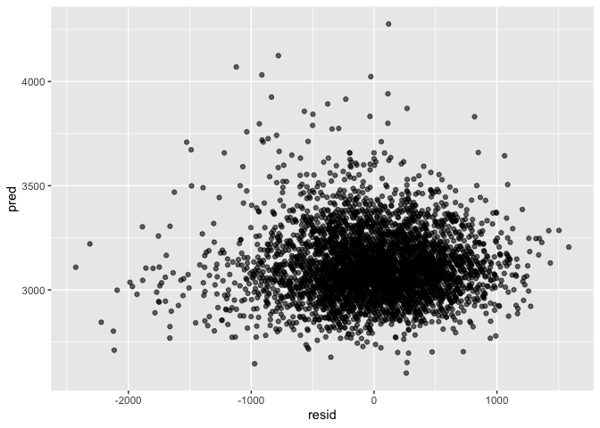
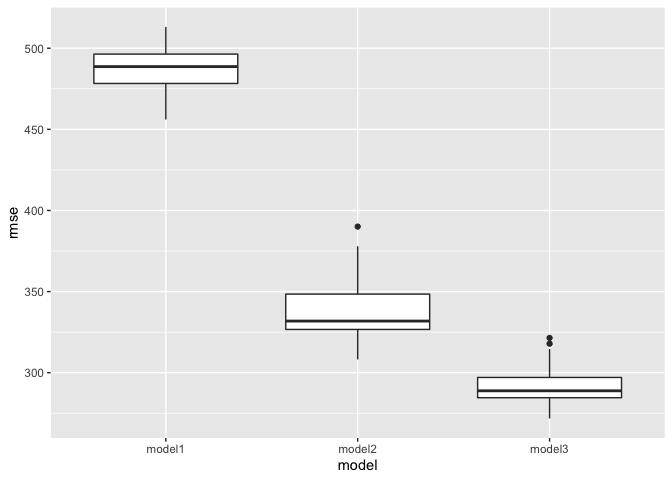
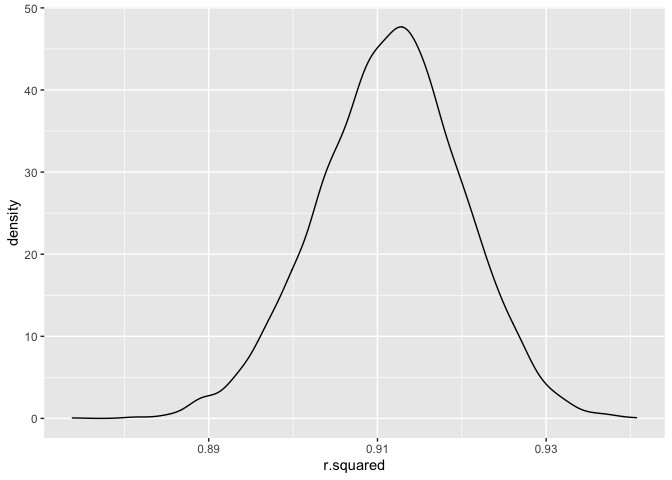
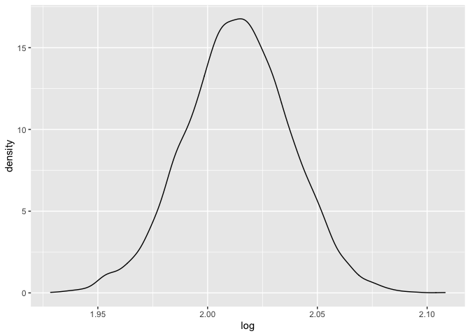

p8105\_hw6\_yw3608
================
Yuxuan Wang
12/2/2021

# Problem 1

**Prepare data,and check if missing data exist and drop na**

``` r
bw_df = 
  read_csv('./data/birthweight.csv') %>% 
  drop_na()
```

**clean data, mutate several variables to factors,change level’s name
and show the data**

``` r
bw_clean = 
  bw_df %>% 
  mutate(
    babysex = as.factor(babysex),
    father_race = as.factor(frace),
    malform = as.factor(malform),
    mother_race = as.factor(mrace)
  )  %>%
  mutate(
    babysex = recode(babysex, "1" = "male", "2" = "female"),
    father_race = recode(father_race, "1" = "white", "2" = "black", "3" = "asian", "4" = "puertorican", "8" = "other", "9" = "unknown"), 
    malform = recode(malform, "0" = "absense", "1" = "present"),
    mother_race = recode(mother_race, "1" = "white", "2" = "black", "3" = "asian", "4" = "puertorican", "8" =   "other")
    ) 
 
head(bw_clean) %>% 
knitr::kable()
```

| babysex | bhead | blength |  bwt | delwt | fincome | frace | gaweeks | malform | menarche | mheight | momage | mrace | parity | pnumlbw | pnumsga |    ppbmi | ppwt | smoken | wtgain | father\_race | mother\_race |
|:--------|------:|--------:|-----:|------:|--------:|------:|--------:|:--------|---------:|--------:|-------:|------:|-------:|--------:|--------:|---------:|-----:|-------:|-------:|:-------------|:-------------|
| female  |    34 |      51 | 3629 |   177 |      35 |     1 |    39.9 | absense |       13 |      63 |     36 |     1 |      3 |       0 |       0 | 26.27184 |  148 |      0 |     29 | white        | white        |
| male    |    34 |      48 | 3062 |   156 |      65 |     2 |    25.9 | absense |       14 |      65 |     25 |     2 |      0 |       0 |       0 | 21.34485 |  128 |      0 |     28 | black        | black        |
| female  |    36 |      50 | 3345 |   148 |      85 |     1 |    39.9 | absense |       12 |      64 |     29 |     1 |      0 |       0 |       0 | 23.56517 |  137 |      1 |     11 | white        | white        |
| male    |    34 |      52 | 3062 |   157 |      55 |     1 |    40.0 | absense |       14 |      64 |     18 |     1 |      0 |       0 |       0 | 21.84508 |  127 |     10 |     30 | white        | white        |
| female  |    34 |      52 | 3374 |   156 |       5 |     1 |    41.6 | absense |       13 |      66 |     20 |     1 |      0 |       0 |       0 | 21.02642 |  130 |      1 |     26 | white        | white        |
| male    |    33 |      52 | 3374 |   129 |      55 |     1 |    40.7 | absense |       12 |      66 |     23 |     1 |      0 |       0 |       0 | 18.60030 |  115 |      0 |     14 | white        | white        |

**regression model**

``` r
 model1 = lm(bwt ~ wtgain * delwt, data = bw_clean)
  summary(model1) %>% 
  broom::tidy()
```

    ## # A tibble: 4 × 5
    ##   term         estimate std.error statistic  p.value
    ##   <chr>           <dbl>     <dbl>     <dbl>    <dbl>
    ## 1 (Intercept)  1763.      87.1        20.2  4.39e-87
    ## 2 wtgain         27.1      3.31        8.18 3.57e-16
    ## 3 delwt           8.03     0.592      13.6  4.76e-41
    ## 4 wtgain:delwt   -0.125    0.0203     -6.19 6.73e-10

``` r
  bw_df %>% 
  modelr::add_predictions(model1) %>%
  modelr::add_residuals(model1) %>%
  ggplot(aes(x = pred, y = resid)) +
  geom_point(alpha = 0.6) 
```

<!-- -->

**prepare the other two required models**

``` r
model2 = lm(bwt ~ blength + gaweeks, data = bw_clean)
model3 = lm(bwt ~ bhead + blength + babysex + bhead*blength + bhead*babysex + blength*babysex + bhead*blength*babysex, data = bw_clean)

summary(model2) %>% 
  broom::tidy()
```

    ## # A tibble: 3 × 5
    ##   term        estimate std.error statistic  p.value
    ##   <chr>          <dbl>     <dbl>     <dbl>    <dbl>
    ## 1 (Intercept)  -4348.      98.0      -44.4 0       
    ## 2 blength        129.       1.99      64.6 0       
    ## 3 gaweeks         27.0      1.72      15.7 2.36e-54

``` r
summary(model3) %>% 
  broom::tidy()
```

    ## # A tibble: 8 × 5
    ##   term                         estimate std.error statistic      p.value
    ##   <chr>                           <dbl>     <dbl>     <dbl>        <dbl>
    ## 1 (Intercept)                 -7177.     1265.       -5.67  0.0000000149
    ## 2 bhead                         182.       38.1       4.78  0.00000184  
    ## 3 blength                       102.       26.2       3.90  0.0000992   
    ## 4 babysexfemale                6375.     1678.        3.80  0.000147    
    ## 5 bhead:blength                  -0.554     0.780    -0.710 0.478       
    ## 6 bhead:babysexfemale          -198.       51.1      -3.88  0.000105    
    ## 7 blength:babysexfemale        -124.       35.1      -3.52  0.000429    
    ## 8 bhead:blength:babysexfemale     3.88      1.06      3.67  0.000245

Compare the model to two other models: model2:length at birth and
gestational age as predictors (main effects only) model3:head
circumference, length, sex, and all interactions (including the
three-way interaction) between these

``` r
  cvpe_df = 
  crossv_mc(bw_clean, 100) %>% 
   mutate(
    train = map(train, as_tibble),
    test = map(test, as_tibble)
  ) %>% 
  mutate(
    model1 = map(train, ~ lm(bwt~ wtgain * delwt, data =.x )),
    model2 = map(train, ~ lm(bwt ~ blength + gaweeks, data = .x)),
    model3 = map(train, ~ lm(bwt ~ bhead + blength + babysex + bhead*blength + bhead*babysex +       blength*babysex + bhead*blength*babysex, data = .x))) %>%
  
  mutate(
    rmse_model1 = map2_dbl(model1, test, ~rmse(model = .x, data = .y)),
    rmse_model2 = map2_dbl(model2, test, ~rmse(model = .x, data = .y)),
    rmse_model3 = map2_dbl(model3, test, ~rmse(model = .x, data = .y)))

cvpe_df %>% 
  select(starts_with('rmse')) %>% 
  pivot_longer(
    rmse_model1:rmse_model3,
    names_to = 'model',
    values_to = 'rmse', 
    names_prefix = 'rmse_'
  ) %>% 
  ggplot(aes(x = model, y = rmse)) +
   geom_boxplot()
```

<!-- -->
\*\*According to the plot, the best model is model 3.

# Problem2

``` r
weather_df = 
  rnoaa::meteo_pull_monitors(
    c("USW00094728"),
    var = c("PRCP", "TMIN", "TMAX"), 
    date_min = "2017-01-01",
    date_max = "2017-12-31") %>%
  mutate(
    name = recode(id, USW00094728 = "CentralPark_NY"),
    tmin = tmin / 10,
    tmax = tmax / 10) %>%
  select(name, id, everything())
```

**bootstrap and calculate r^2, ci and plot**

``` r
bootstrap_df_r2 = 
  weather_df %>%
  bootstrap(n = 5000, id = "bootstrap")%>%
 mutate(
    fit =map(.x = strap, ~lm(tmax ~ tmin, data = .x)),
    result = map(fit, broom::glance)
    ) %>%
  select(bootstrap,result)%>%
  unnest(result)


r_2_CI =
  bootstrap_df_r2 %>% 
  summarize(
  lower_bound = quantile(adj.r.squared, 0.025), 
  upper_bound = quantile(adj.r.squared, 0.975)) %>% 
  knitr::kable() 
r_2_CI   
```

| lower\_bound | upper\_bound |
|-------------:|-------------:|
|    0.8937935 |    0.9269726 |

``` r
r_2_plot =
  bootstrap_df_r2 %>% 
  ggplot(aes(x = r.squared)) +
  geom_density() 
r_2_plot
```

<!-- -->

**bootstrap and calculate log(β̂ 0∗β̂ 1), ci and plot**

``` r
bootstrap_df_log = 
  weather_df %>%
  bootstrap(n = 5000, id = "bootstrap")%>%
 mutate(
    fit =map(.x = strap, ~lm(tmax ~ tmin, data = .x)),
    result2 = map(fit, broom::tidy)
    ) %>%
  select(bootstrap,result2)%>%
  unnest(result2)


log =
  bootstrap_df_log %>% 
  select(bootstrap, term, estimate) %>% 
  pivot_wider(
    names_from = term,
    values_from = estimate) %>% 
  select(intercept ="(Intercept)",tmin) %>% 
  mutate(log = log(intercept*tmin)) 
  
log_showresult =
  head(log,10) %>%
  select(log) %>% 
  knitr::kable() 
log_showresult
```

|      log |
|---------:|
| 2.041461 |
| 2.003468 |
| 2.000735 |
| 1.995351 |
| 2.005406 |
| 2.005138 |
| 1.993128 |
| 2.021069 |
| 2.007625 |
| 2.010394 |

``` r
log_CI =
log %>% 
  summarize(
    lower_bound = quantile(log, 0.025),
    upper_bound = quantile(log, 0.975)
  ) %>% 
  knitr::kable()
log_CI
```

| lower\_bound | upper\_bound |
|-------------:|-------------:|
|     1.965332 |     2.059461 |

``` r
log_plot = 
log %>% 
  ggplot(aes(x = log)) +
  geom_density() 
log_plot
```

<!-- -->
